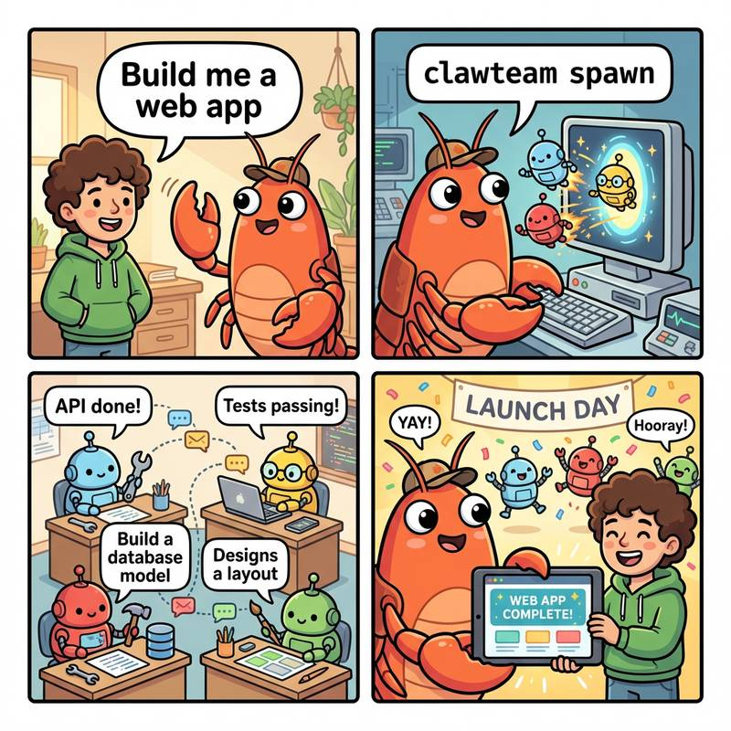

# ClawTeam vs DeerFlow：多 Agent 系统架构深度对比研究报告

**作者：Dylan**
**日期：2026-03-23**

---

多 Agent 系统是当前 AI 应用领域最热的方向之一。最近我深入研究了 ByteDance 的 **DeerFlow** 和港大的 **ClawTeam** 两个开源框架，发现它们的架构差异远比表面上看起来要大。

> 这是一篇源码级研究，不是功能介绍文。每个结论都有具体的文件名和行号。

---

## 1. 它们分别解决了什么问题？

**ClawTeam** 想做到一件事：给 AI Agent 一个目标，它自己组建团队完成。

这个框架的核心场景是：8 个 Agent 在 8 块 GPU 上自主搜索最优 ML 配置，做了 2400 + 次实验，最终把模型压缩了 6.4%。整个过程中，人类只负责定义目标，Agent 们自己分工、自己协调、自己合并结果。

**DeerFlow** 则更像一个结构化的深度研究框架。

你提一个复杂问题（比如"分析特斯拉的竞争优势"），它会通过 Lead Agent 分解任务，调用多个 subagent 并行搜集不同角度的信息，最后汇总成一份完整报告。DeerFlow 强调的是过程的标准化和可追溯性。

---

## 2. 最重要的事实：两者都是星型架构

我最初以为 DeerFlow 是"流水线型"架构，但深入代码后才发现：**两者本质都是星型/Hub-and-Spoke 架构，即有一个中心节点协调多个叶节点。**

真正的问题是：**星的质量不同。**

```
ClawTeam（进程级星型）          DeerFlow（线程级星型）

   Leader ────┐                Lead Agent ────┐
  /  |    \   │              /  |    \   │
Worker1 Worker2 Worker3     Sub1  Sub2  Sub3
(独立OS进程)                (线程池线程)
```




---

## 3. 进程 vs 线程：关键差异在这里

### ClawTeam：每个 Worker 是独立进程

```python
# clawteam/spawn/tmux_backend.py:53-59
subprocess.Popen(
    ["tmux", "new-window", "-t", session_name, command]
)
```

每个 Worker 有独立的进程 ID、环境变量和工作目录。崩溃一个，不影响其他的。

### DeerFlow：每个 Subagent 是线程

```python
# deerflow/subagents/executor.py:71-75
_execution_pool = ThreadPoolExecutor(max_workers=3)
MAX_CONCURRENT_SUBAGENTS = 3  # 并行上限 3
```

Subagent 运行在线程池里，受 Python GIL 限制。对于 I/O 密集型任务（等 API 返回）可以真正并行，但 CPU 密集型工作会被序列化。

### 两者用的其实是同一个类

```python
# Lead Agent 和 Subagent 都调用 langchain.agents.create_agent()
# 配置不同，但底层类相同
```

---

## 4. 几个你可能不知道的源码发现

**① DeerFlow 的沙箱在本地模式下没有隔离**

默认安装时，`subprocess.run(shell=True)` 在主机上直接跑命令，没有任何容器隔离。只有配置了 AioSandbox 才会启用 Docker。

**② DeerFlow 的 Memory 不是向量数据库**

每次对话追加写入 JSONL 文件，检索时读全部历史拼接成字符串。没有语义搜索，没有向量索引，随数据积累性能线性下降。

**③ DeerFlow 并行 subagent 上限只有 3 个**

硬编码在 `executor.py:492`，最小 2，最大 4。LLM 如果一次生成 5 个 task 调用，超出的 2 个会被直接丢弃（有 WARNING 日志但任务本身丢失）。

**④ ClawTeam Worker 崩溃后依赖任务永久卡死**

`blocked_by` 的解除依赖 `update_task --status completed` 调用。Worker 不在了就不会触发，依赖它的任务永远处于 BLOCKED 状态。

---

## 5. 一张图总结核心差异

以下是关键数据对比：

| 维度 | ClawTeam | DeerFlow |
|---|---|---|
| 子节点生命周期 | 长期（进程级） | request 级（线程级） |
| 并行上限 | 无限制 | 3（硬编码） |
| 内存系统 | 不实现 | append-only JSONL |
| 代码隔离 | Git Worktree | 无（本地模式） |
| 消息类型 | 9 种（含广播） | 仅函数返回值 |
| Worker 间通信 | ✅ P2P 直连 | ❌ 不支持 |
| 崩溃后自动恢复 | ❌ 无 | ❌ 无 |

---

## 6. 怎么选？

**选 ClawTeam 当你需要：**
- 真实 OS 级进程隔离
- 超过 3-4 个 Agent 并行工作
- Worker 之间直接通信
- Git 分支管理（代码合入需要真实分支）
- 消息持久化（Agent 重启后不丢消息）

**选 DeerFlow 当你需要：**
- MCP 工具生态
- 实时流式响应（SSE）
- 10 + 中间件的标准化处理链
- Memory 跨会话持久化
- I/O 密集型的研究任务

---

## 结语

两个框架代表了两种不同的工程哲学：ClawTeam 追求 Agent 的"自主性"，DeerFlow 追求执行过程的"可控性"。没有绝对的好坏，只有场景的匹配。

源码我已全部索引，感兴趣的同学可以直接去看：
- ClawTeam：`clawteam/spawn/tmux_backend.py`
- DeerFlow：`deerflow/subagents/executor.py`

---

> 完整研究报告（含所有源码索引）已发布在博客：
> https://www.dylanslife.com/posts/2026-03-23-clawteam-vs-deerflow-research-report.html
